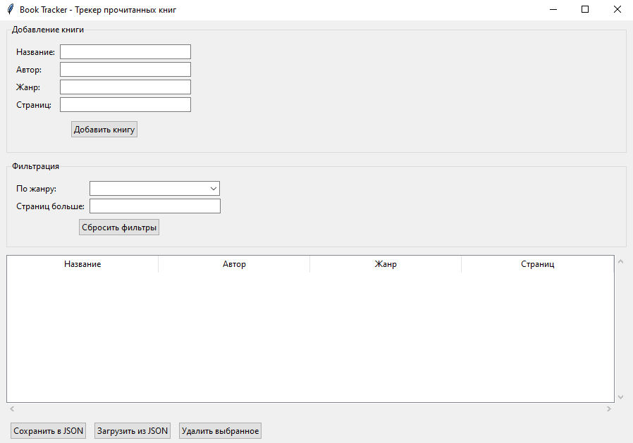
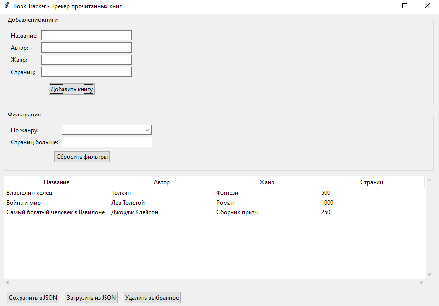
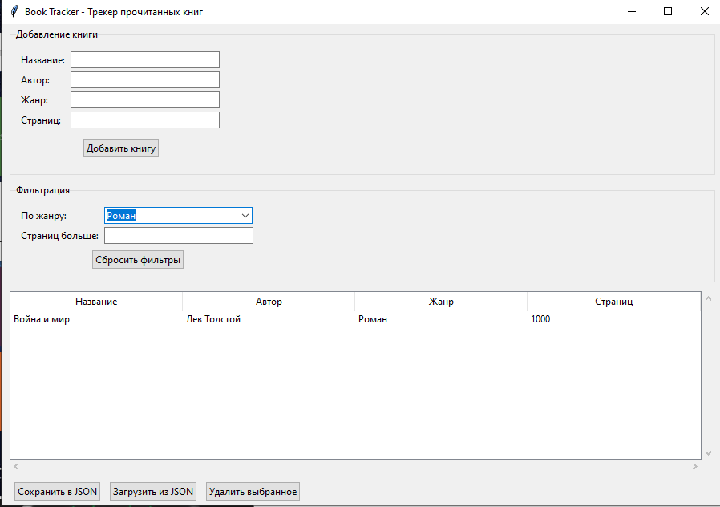
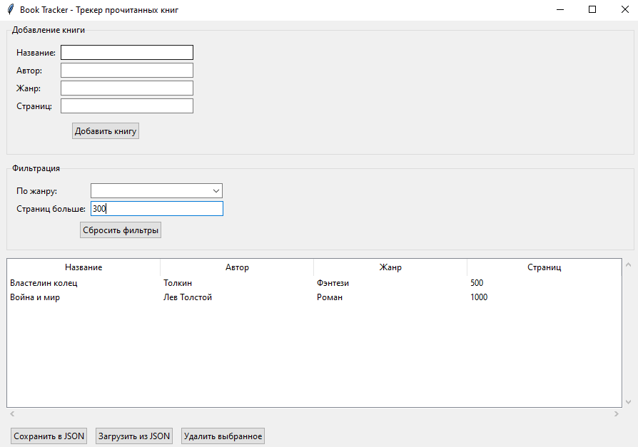

# Book Tracker - Трекер прочитанных книг

## Информация об авторе:
Имя: Гусен  
Фамилия: Гусенов

## Описание программы:
Book Tracker - это GUI-приложение для управления списком прочитанных книг. Программа позволяет:

- Добавлять новые книги в список
- Просматривать список книг в виде таблицы
- Фильтровать книги по жанру и количеству страниц
- Сохранять и загружать данные в формате JSON
- Проверять корректность вводимых данных

## Требования:
- Python 3.6 или выше
- Библиотека tkinter (встроена в Python)

## Инструкция по запуску:
1. Убедитесь, что Python установлен на вашем компьютере
2. Сохраните код программы в файл `book_tracker.py`
3. Запустите программу командой:
   ```bash
   python book_tracker.py
   
## Примеры использования

### Добавление книги
1. Заполните поля: Название, Автор, Жанр, Страниц
2. Нажмите "Добавить книгу"
3. Книга появится в таблице

### Фильтрация по жанру
1. Выберите жанр из выпадающего списка
2. Таблица отобразит только книги этого жанра

### Фильтрация по страницам
1. Введите число в поле "Страниц больше"
2. Будут показаны книги с количеством страниц больше указанного

### Сохранение данных
1. Нажмите "Сохранить в JSON"
2. Данные сохранятся в файл books.json
3. При следующем запуске нажмите "Загрузить из JSON"

## Скриншоты





